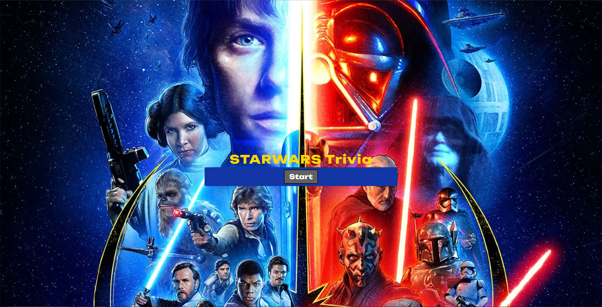
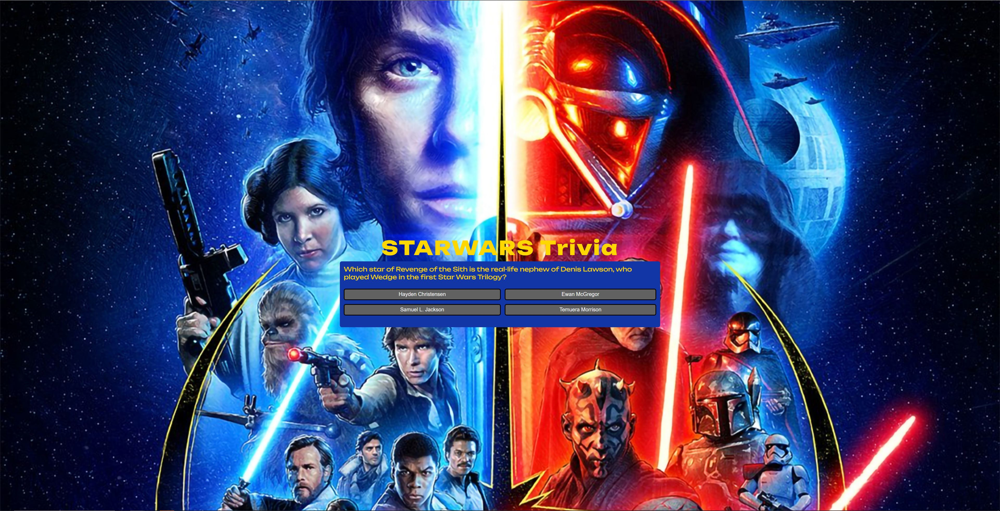
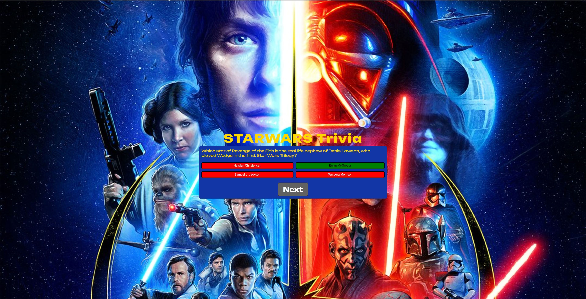
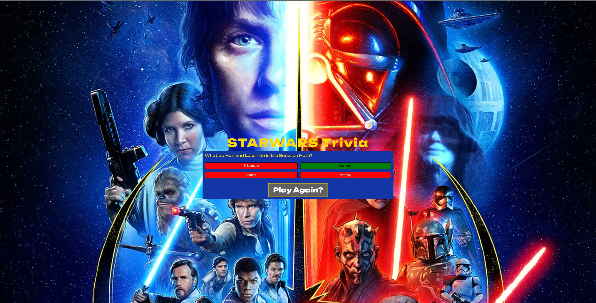
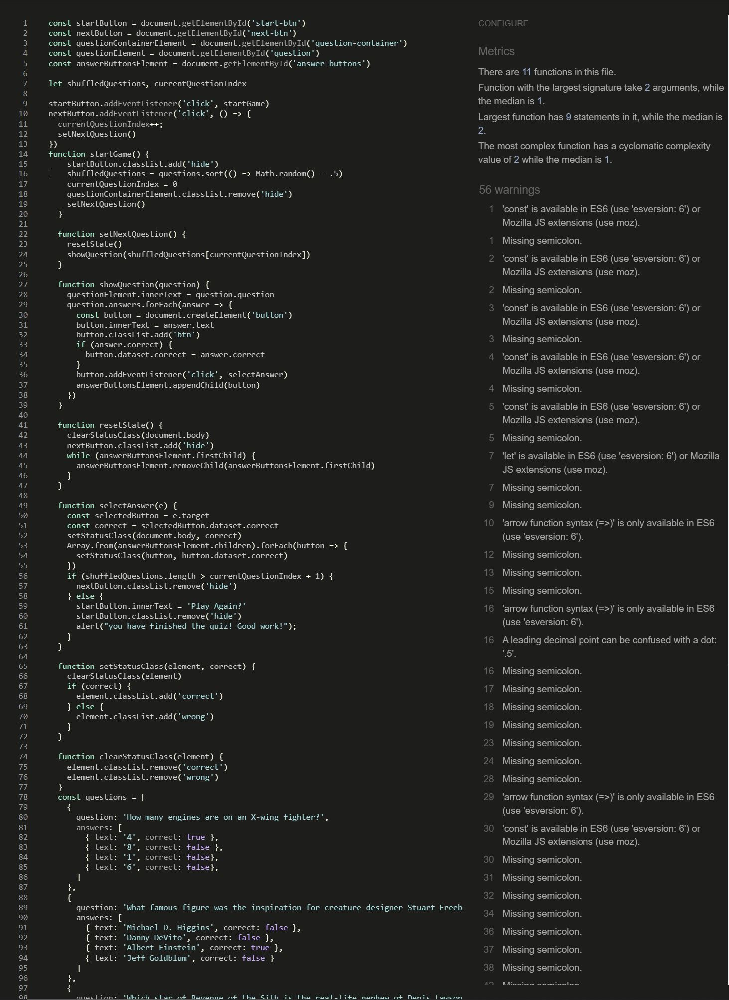
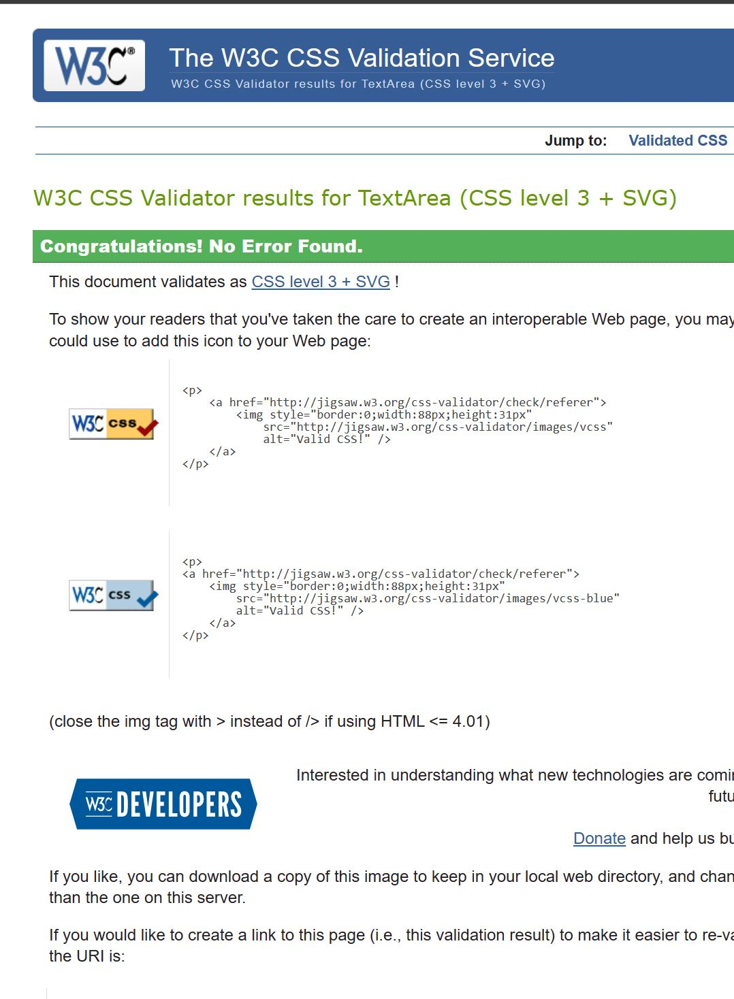
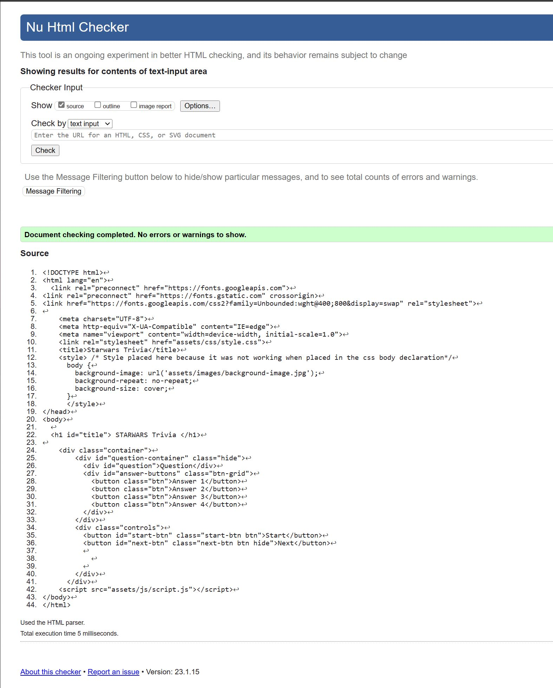

## Quiz Purpose

Starwars Trivia provides the user a quiz with various questions relating to the topic of starwars. The quiz provides a user friendly experience that can be played quickly, and a number of times if the user wishes. 
The quiz is designed to operate on any device available.

The purpose of the quiz is to present the user with 4 questions relating to the starwars cinematic universe

The quiz has been designed for the second project in the Code Institutes Diploma in Full Stack Software Development.

Languages used - HTML5, CSS3 and Javascript.

Link to live website as follows - 

## User Stories
New User
I want to learn something new 
I want a quick and easy method of learning fun facts
Im a fan of the topic and I want to see if the quiz is interesting or if the info is even correct

Returning User
I want to test my memory on the topic
I am showing the quiz to a friend to compare results
I am a friend of the author and I need to test it

## Goal
The aim of the game is to get every answer correct and to remember the facts, just incase the user ends up at a quiz show or pub quiz!

## Features
Start Page

Question

Correct Answer

Incorrect Answer

Last Page

# Start Quiz
The initial page shows a start button, prompting the user to begin the game and discover the first question that is randomly sequenced. 

# Quiz Question
Once the user has clicked to start the quiz they will be shown a question at random and will have four options to choose from.
When the user makes a selection the buttons will change color signifying correct (green) and incorrect (red).
The original idea was to have the background also change color but I found this to be distracting and instead changed the background to be an image relating to the subject.

# Correct Answer

# Incorrect Answer

# Restart Quiz
When the quiz is out of questions, the user will be shown the 'Play again?' button, this will reset the quiz

# Typography
Fonts used were imported from Google fonts -<link href="https://fonts.googleapis.com/css2?family=Unbounded:wght@400;800&display=swap" rel="stylesheet">

font-family:Unbounded

## Testing

I tested the website on both Google chrome and Microsoft Edge.
I sent the website link to friends to test on different devices.
I tested buttons and functionality of the quiz by spamming them with inputs to try and provoke an issue.

# Validation

# JSHint
warnings relating to use of let identified with JSHint 

# W3C CSS
No errors were returned when CSS was passed through the official W3C CSS Validator 

# W3C HTML
No errors were returned when HTML was passed through the official W3C HTML Validator

# Bugs
bug 1 - Heading was floating to the left of the game container on different screen sizes, this was fixed by using the flex-direction command

bug 2 - while styling the game area the "play again?" button would not show sometimes, this was fixed by changing the order of some of the css code

# Unfixed Bugs
There is no unfixed bugs.

# Deployment
The site has been deployed using Github pages.
I went to the settings page of my projects repository, selected the pages tab, selected the Main branch and selected the save button provided. 

# Authors
https://github.com/T-McGauley

# Credits and Acknowledgements
Used Web Dev Simplified - Web Dev Simplified

Used Brian Design code from tutorial in order to implement javascript functionality for this quiz  - Brian Designs

Used W3Schools multiple times for many issues big or small

Referred to code institutes walkthrough projects
